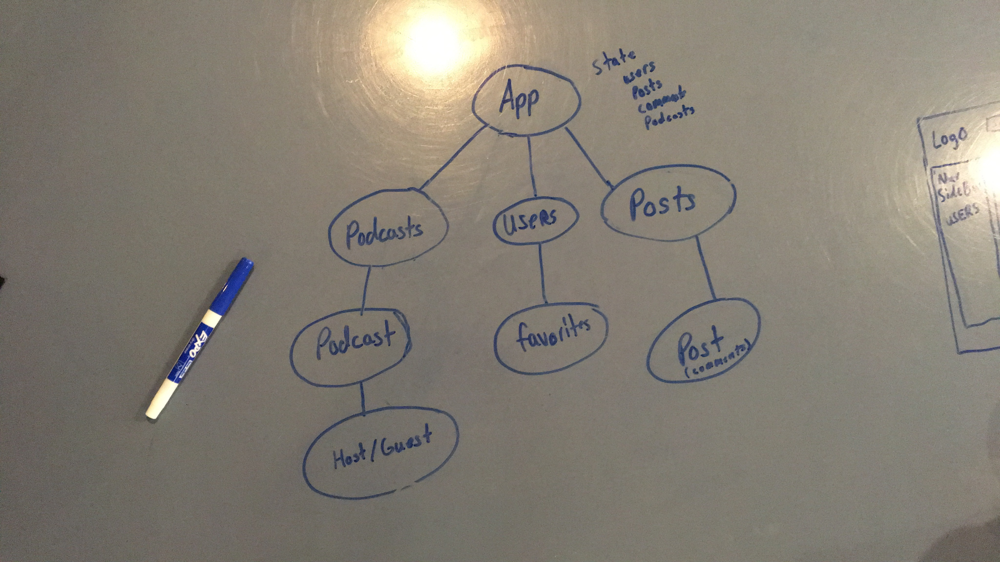
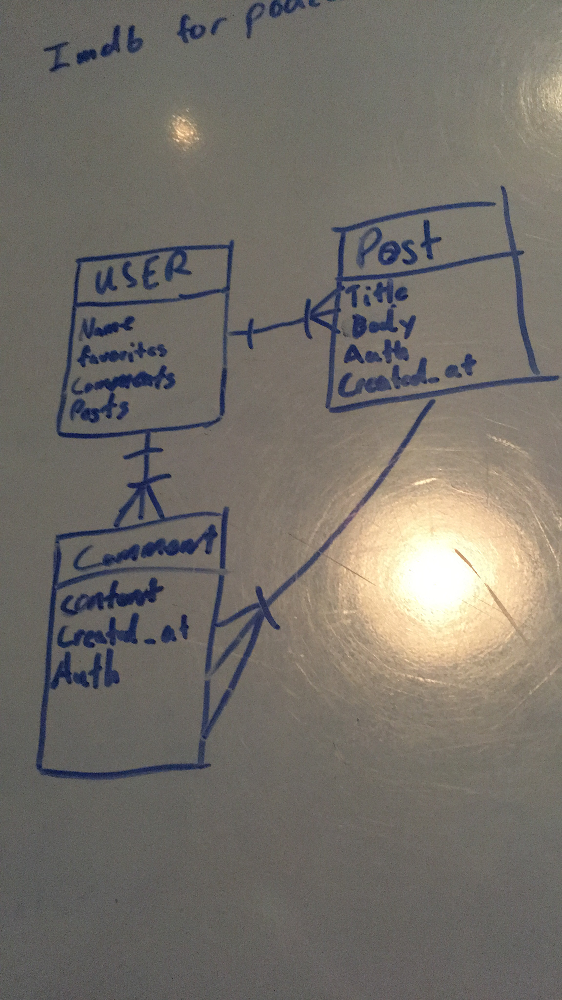
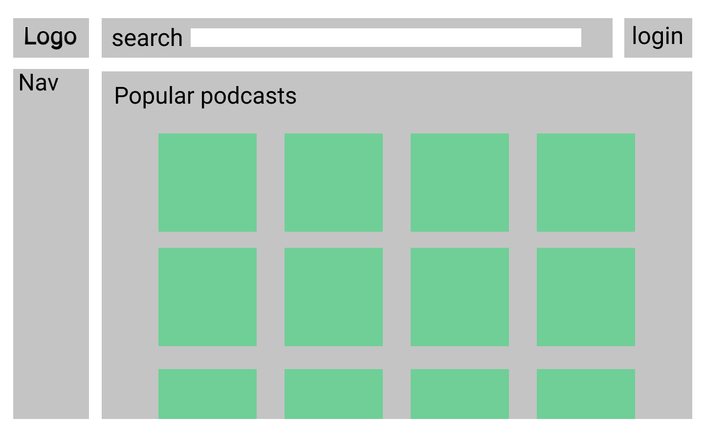
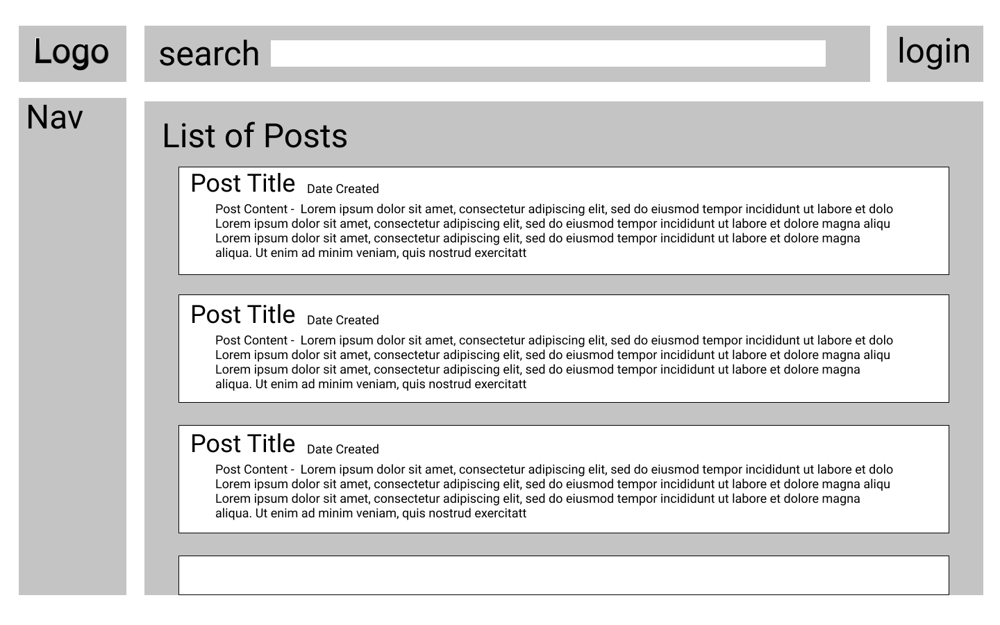
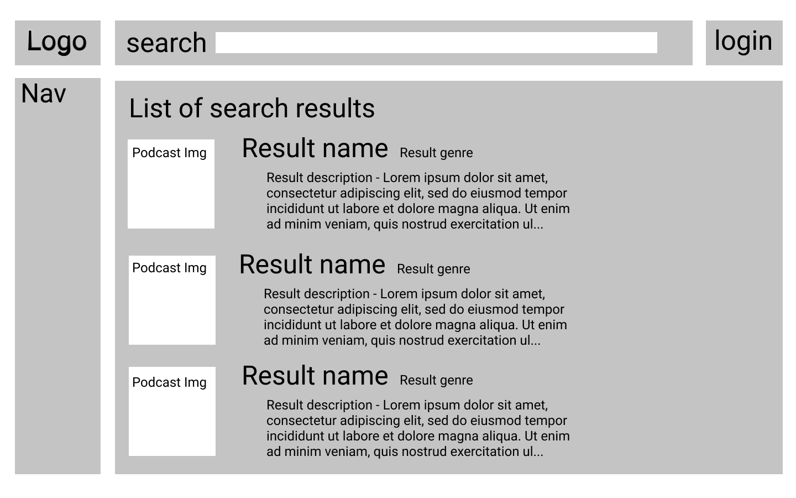
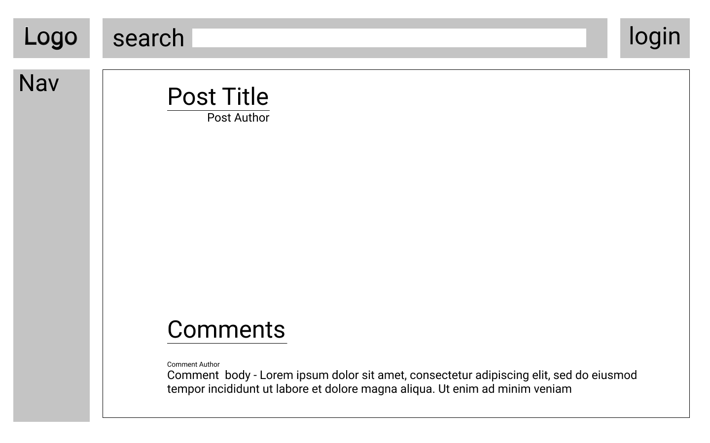
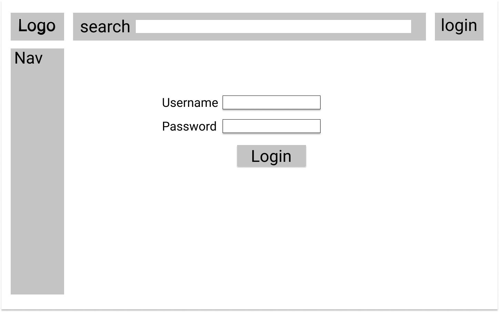
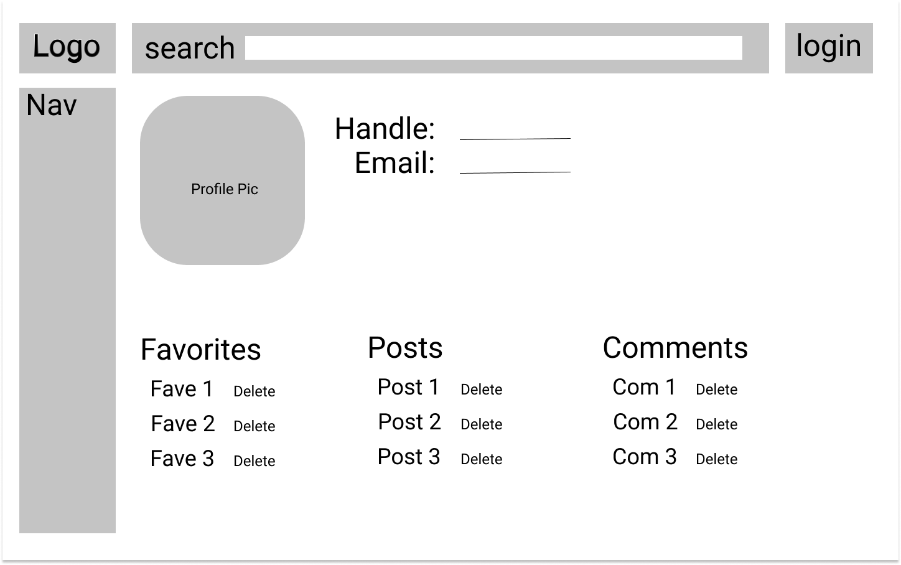
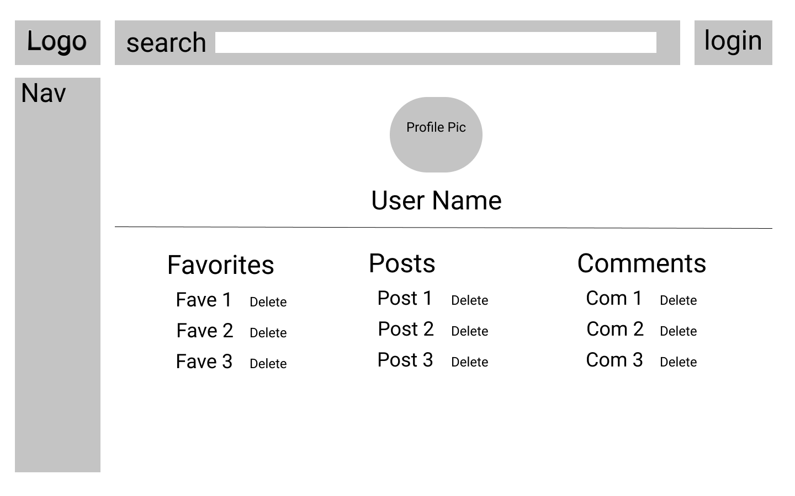

Project 4

Thank you Damian for getting me unstuck while trying to establish ownership between entities!

Thank you Shannon for helping me with my routes.

# About the Project

Podcast Data Base(PCDB) is a place for podcast lovers to find new podcasts or discuss their favorites. It consists of a search engine that will return relevant podcasts and a message board where user can create profiles, post thoughts, or comment on other's posts.

## Links

[Deployed Site](https://mighty-atoll-86780.herokuapp.com/)

[Trello board](https://trello.com/b/llubGrYh/project4)

## Technologies Used

Component Tree & ERD

Wire Frames

